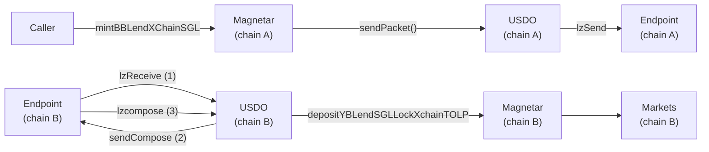

# `MagnetarMintXChainModule.sol`:`mintBBLendXChainSGL` can be used to manipulate user positions by abusing whitelist privileges

## Description

The Magnetar functions use `_checkSender` function to check if the caller should be allowed to perform operations on the account. The function allows operations if the caller is the owner, or if the caller is a whitelisted trusted address.
    
```solidity
function _checkSender(address _from) internal view {
    if (_from != msg.sender && !cluster.isWhitelisted(0, msg.sender)) {
        revert Magnetar_NotAuthorized(msg.sender, _from);
    }
}
```

However, this means that if a malicious user is able to make a whitelisted contract call magnetar functions with their own payload, they can steal tokens and wreak havoc on other user’s accounts!

The function `depositYBLendSGLLockXchainTOLP` in the `MagnetarAssetXChainModule` contract uses a similar check. This function deposits and lends into markets, for the account passed in as `data.user`. Crucially, it also extracts tokens from `data.user` for these operations. So if a malicious user was able to get this function called by a whitelisted contract and pass in a malicious `data.user`, they can cause the target user to lose tokens and manipulate their market positions. This is a high severity issue and the path to attack is demonstrated below.

## Proof of Concept

The entry point is the `MagnetarMintXChainModule` contract’s `mintBBLendXChainSGL` function for the attacker. This is a special function, in the sense that this sets up the system for multiple cross chain calls. This function calls the `USDO` function which then does an lzcompose call on another chain to the Magnetar contract again. This is a complex function and the attacker can use this to manipulate the system.

The flow of control of this function is shown below:



As shown in the above diagram, the caller initiates the call to the Magnetar contract. The Magnetar contract then does a cross-chain call via the `USDO` contract. It also sends along a lzcompose message which will be executed on chainB. On chainB, the `USDO` contract receives the call and initiates the lzcompose execution. Due to how the system is designed, this lzcompose message being executed by the `USDO` contract is actually a call to the Magnetar contract on chainB, specifically the `depositYBLendSGLLockXchainTOLP` function.

This can be shown by the fact that on chainA, the Magnetar encodes the lzcompose message into a struct.
    
```solidity
DepositAndSendForLockingData memory lendData = abi.decode(tapComposeMsg_, (DepositAndSendForLockingData));
lendData.lendAmount = data.mintData.mintAmount;
data.lendSendParams.lzParams.sendParam.composeMsg =
    TapiocaOmnichainEngineCodec.encodeToeComposeMsg(abi.encode(lendData), msgType_, msgIndex_, nextMsg_);
```

Then this same `DepositAndSendForLockingData` struct is accepted as an input on chainB `depositYBLendSGLLockXchainTOLP` function.
    
```solidity
function depositYBLendSGLLockXchainTOLP(DepositAndSendForLockingData memory data) public payable
```

On chainB, the `data.user` is the target of the operation. Since the caller is the `USDO` contract, which is not the `data.user` value, for this to work, the `USDO` contract must have been whitelisted by the system.

This means the malicious user can send in any `data.user` in their `data.lendSendParams.lzParams.sendParam.composeMsg` field, and the `USDO` contract will execute it on their behalf. No access checks will be performed, since the `USDO` contract is whitelisted. The target just needs to have given allowance to the Magnetar contract itself to perform market operations on their behalf. There are no checks on `DepositAndSendForLockingData.user` field in the `mintBBLendXChainSGL` function on chainA, so the malicious user can send in practically any address they want, and the whitelisted `USDO` contract will carry out the transaction.

This skips a crucial user check and manipulates other user positions; hence, it is a high severity issue.

## Recommendation

The architecture of this crosschain call is quite vulnerable. Due to the whitelist, any function call that can be done via `USDO` contract is risky since it can override the Magnetar checks. The `mintBBLendXChainSGL` function on chainA should make sure the lzcompose `data.user` is the same as the current `data.user`, but this only blocks a single attack vector. `USDO` contract is crosschain compatible and allows lzcompose message, so any other methods which can be used to trigger such a cross chain call can abuse the whitelist.

PR [here](https://github.com/Tapioca-DAO/tapioca-periph/commit/3d38855c34bac2518bdf58e6a78b64b1c0e78438).

## Derived Narrative

The following field is derived content and may not be source-grounded:

The vulnerability is an authorization bypass that stems from a whitelist‑based access control in the Magnetar cross‑chain modules. The internal _checkSender function only permits an operation when the caller is either the account owner or a contract that has been added to a trusted whitelist. Because the whitelist check is performed on the immediate caller (the USDO contract) and not on the user address embedded in the payload, a malicious actor can craft a cross‑chain compose message that specifies any victim address in the data.user field of the depositYBLendSGLLockXchainTOLP call. When the attacker invokes mintBBLendXChainSGL on chain A, the Magnetar contract forwards a message through the USDO contract to chain B, where the whitelisted USDO contract executes depositYBLendSGLLockXchainTOLP with the attacker‑chosen data.user. The victim must have previously granted the Magnetar contract allowance to move their tokens, so the call silently transfers tokens from the victim’s balance and alters their market position without any on‑chain signature from the victim. This can happen whenever a whitelisted contract is allowed to forward arbitrary payloads and the target function does not verify that data.user matches msg.sender or that the caller is authorized to act on behalf of that user. The impact is loss of tokens, unexpected zero balances, and corrupted loan or liquidity positions for any user whose allowance is in place, effectively breaking the protocol’s accounting guarantees. The issue was discovered during a security audit that examined the access‑control logic of cross‑chain functions and noticed that the whitelist check does not cascade to the user field inside the composed message, making the flaw subtle and easy to miss because the transaction appears to be initiated by a trusted contract. From a user’s perspective the symptom is that after approving the protocol they may see their balance drop to zero or a loan position disappear even though they never submitted a withdrawal, violating the expectation that only they can move their assets. The bug belongs to the class of “privileged‑contract‑parameter‑tampering” or “whitelist abuse” vulnerabilities where a trusted contract can be tricked into acting on arbitrary accounts. To remediate, the contract should enforce that the user address in the payload equals msg.sender or is otherwise explicitly authorized, add a second‑level check inside the cross‑chain compose handling, and consider limiting or removing the blanket whitelist privilege for functions that move user funds.
